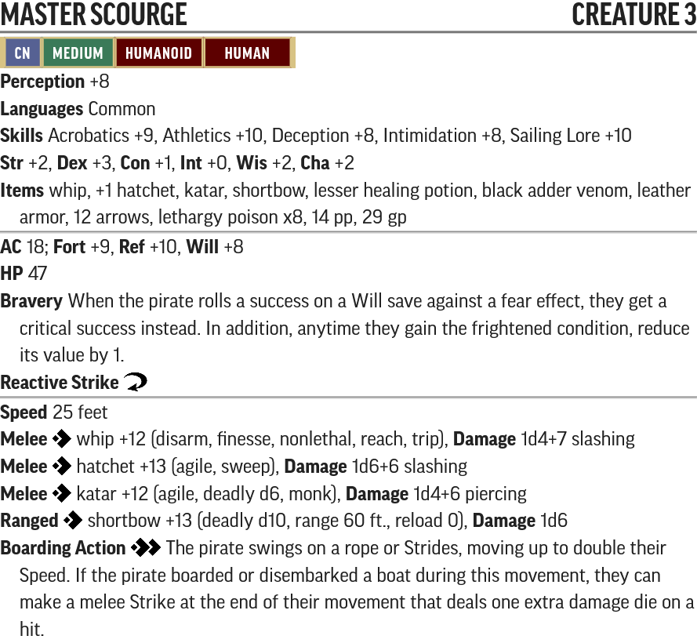

# The Wormwood Mutiny - Creature Statblocks

Any listed items with a carat (^) at the end is a item that does not exist in the current Pathfinder 2e SRD. These items will be linked below their statblock.

Use the PF2 Tools JSON files with [https://monster.pf2.tools/]. Be aware these do **NOT** import directly into FoundryVTT.

## Named NPCs

### Master Scourge

* [PF2 Tools JSON](JSONs/MasterScourge.json)
* [PDF](PDFs/MasterSourge.pdf)

Sef is just an [Elite Skulk](http://2e.aonprd.com/Monsters.aspx?ID=805) with a bonus Throw Bomb action.

## New Creatures

### Wormwood Pirate

* [PF2 Tools JSON](JSONs/WormwoodPirate.json)
* [PDF](PDFs/WormwoodPirate.pdf)
